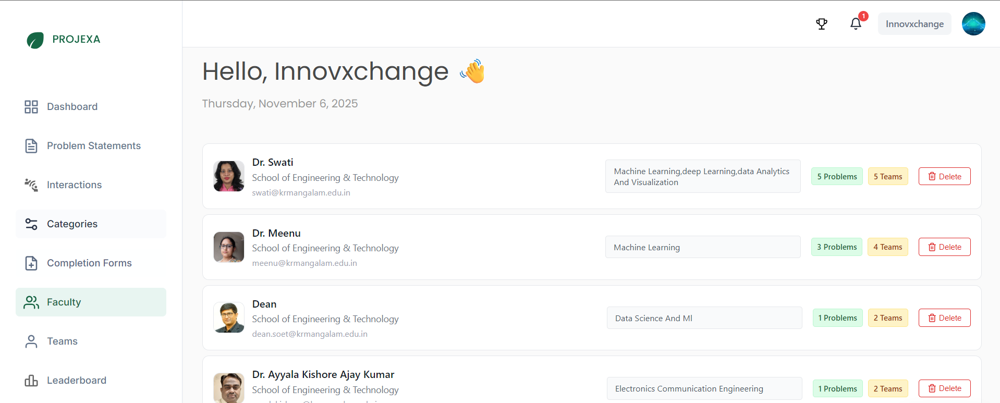

# Admin — Faculty

The Faculty management system serves as the central hub for managing all institutional staff members within Projexa. Faculty members form the backbone of the platform, serving in various roles including mentors, coordinators, and administrators.

## Understanding Faculty in Projexa

### What is Faculty?

Faculty represents all staff members of the institution who participate in the Projexa ecosystem. This includes:

- **Teaching Staff**: Professors, lecturers, and instructors
- **Administrative Staff**: Those involved in academic administration
- **External Mentors**: Industry professionals or guest experts (when applicable)

### Faculty Role Hierarchy

Every faculty member in Projexa operates within a role-based system:

1. **Default Role - Mentor**: All faculty members are mentors by default and can be assigned teams to guide
2. **Coordinator Role**: Admins can assign faculty members as coordinators to manage specific academic years within sessions
3. **Admin Role**: Highest level of access for platform administration

### Key Faculty Responsibilities

- **As Mentors**: Guide assigned teams through their project journey
- **As Problem Contributors**: Submit problem statements for student teams to select
- **As Coordinators**: Manage students and teams for assigned academic years (when appointed)
- **As Platform Users**: Maintain accurate profile information and engage with the system

## Faculty Information System

### Automatic Registration

Faculty members join the platform through an automatic registration process:

- **Work Email Authentication**: Faculty automatically gain access when logging in with their institutional email
- **Profile Completion**: Upon first login, faculty members complete their basic profile information
- **Immediate Access**: Once registered, they can immediately participate as mentors and problem contributors

### Faculty Profile Information

Each faculty member's profile contains:

**Basic Information**:
- Name and title (e.g., Dr., Prof.)
- Department/School affiliation
- Institutional email address
- Contact number
- Employee ID (optional)

**Professional Details**:
- Specialization areas (e.g., "Machine Learning, Deep Learning, Data Analytics and Visualization")
- Academic background
- Areas of expertise

**Platform Activity**:
- Number of problem statements submitted
- Current team mentoring count
- Historical mentoring data
- Interaction calendar

### Specialization Importance

The specialization field serves critical functions:

- **Strategic Assignment**: Coordinators use specializations to match faculty mentors with relevant teams
- **Expertise Matching**: Ensures teams receive guidance from faculty with appropriate technical knowledge
- **Quality Mentorship**: Improves project outcomes through expert-student alignment
- **Resource Optimization**: Helps distribute mentoring load based on expertise areas

## Faculty Activity Tracking

### Problem Statement Contributions

Faculty members actively contribute to the platform by submitting problem statements:

- **Primary Contributors**: Most problem statements come from internal faculty
- **Open Submission**: External mentors and industry professionals can also contribute
- **Quality Source**: Faculty-submitted problems ensure academic relevance and feasibility

### Team Mentoring

Faculty members serve as mentors for student teams:

- **Team Assignment**: Coordinators assign teams to faculty mentors based on expertise and availability
- **Multiple Teams**: Faculty can mentor multiple teams simultaneously across different academic years
- **Ongoing Guidance**: Provide continuous support through regular interactions and meetings

### Interaction Management

Faculty mentors manage their team interactions through:

- **Calendar System**: Visual interface showing scheduled, completed, and upcoming interactions
- **Team Dashboard**: Access to all assigned teams with filtering options by academic year
- **Communication Tools**: Direct messaging and meeting scheduling capabilities
- **Progress Tracking**: Monitor team development and project milestones

## Administrative Management

### Admin Capabilities

As an admin, you can manage faculty members through:

**Viewing Faculty Information**:
- Complete faculty directory with profiles and activity summaries
- Problem statement contributions count
- Current team mentoring assignments
- Contact information and specializations

**Profile Access**:
- Click on any faculty card to access their complete dashboard
- View their mentoring calendar and team assignments
- Access contact information for direct communication
- Monitor their platform activity and engagement

**Faculty Removal**:
- Delete faculty members when they leave the institution
- Ensure clean data management and access control
- Maintain accurate institutional representation

### Faculty Self-Management

Faculty members have control over their own profiles:

- **Profile Updates**: Edit personal information, contact details, and specializations
- **Availability Management**: Manage interaction scheduling and team communications
- **Professional Information**: Update expertise areas and academic credentials

### Data Insights Available

For each faculty member, admins can see:

- **Contribution Metrics**: Number of problem statements submitted
- **Mentoring Load**: Current number of teams being mentored
- **Engagement Level**: Activity through interactions and platform usage
- **Expertise Areas**: Specialization information for strategic assignment decisions

## Best Practices for Faculty Management

### Strategic Role Assignment

- **Expertise Matching**: Consider faculty specializations when coordinators assign mentoring roles
- **Workload Balance**: Monitor mentoring load distribution across faculty members
- **Role Rotation**: Provide opportunities for different faculty to serve as coordinators

### Communication and Support

- **Clear Expectations**: Ensure faculty understand their responsibilities in different roles
- **Platform Training**: Provide guidance on using Projexa features effectively
- **Feedback Channels**: Maintain open communication for platform improvement suggestions

### Data Management

- **Regular Review**: Periodically review faculty information for accuracy
- **Timely Updates**: Remove departed faculty members promptly
- **Access Monitoring**: Ensure appropriate access levels for different roles

### Quality Assurance

- **Engagement Monitoring**: Track faculty participation in mentoring activities
- **Problem Statement Quality**: Monitor the relevance and quality of submitted problem statements
- **Student Feedback**: Consider team feedback about mentoring effectiveness

## Integration with Other Features

### Session Management

Faculty members operate within the context of sessions:
- Coordinators are assigned to sessions by admins
- Mentors work with teams within active sessions
- Role assignments can change between sessions

### Problem Statement Workflow

Faculty contributions integrate with the approval system:
- Faculty submit problem statements for admin review
- Approved statements become available for team selection
- Teams work under faculty mentorship on selected problems

### Interaction System

Faculty mentoring activities are tracked through:
- Scheduled interactions between mentors and teams
- Interaction history and effectiveness monitoring
- Calendar integration for scheduling management

---

*The Faculty system ensures quality mentorship and academic guidance while providing administrators with comprehensive tools for staff management and resource allocation.*

---

_Last updated: 2025-11-06_
