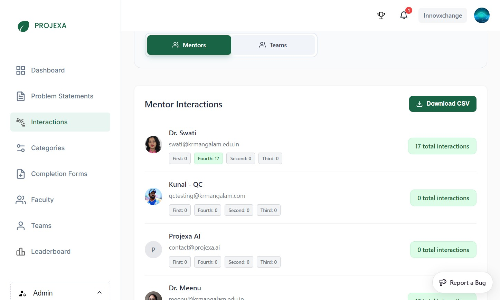

# Admin — Interactions

The Interactions monitoring system provides comprehensive oversight of mentor-team engagement throughout the academic session. This feature enables administrators to track the frequency and quality of mentoring activities, ensuring all teams receive adequate guidance and support.

## Understanding Interactions

### What is an Interaction?

An interaction represents a formal meeting between a team and their assigned mentor. These meetings are crucial for:

- **Project Guidance**: Mentors provide technical and strategic direction
- **Progress Monitoring**: Regular check-ins ensure teams stay on track
- **Skill Development**: Direct mentorship enhances learning outcomes
- **Problem Resolution**: Teams can address challenges with expert support

### Interaction Workflow

1. **Initiation**: Team leader requests a meeting with their assigned mentor
2. **Mentor Response**: Mentor approves the meeting request and sets the schedule
3. **Meeting Execution**: Teams and mentors conduct the interaction (online or offline)
4. **Documentation**: Mentor logs attendance, ratings, and assigns tasks
5. **Follow-up**: Teams work on assigned tasks until the next interaction

### Automatic Cancellation System

If mentors don't respond to interaction requests within the specified timeframe, meetings are automatically cancelled to prevent teams from waiting indefinitely. This ensures teams can quickly reschedule with available mentors.

## Monitoring Purpose

The Interactions tab serves multiple administrative functions:

### Quality Assurance
- **Engagement Verification**: Confirm all teams are receiving regular mentorship
- **Mentor Activity**: Monitor mentor participation across their assigned teams
- **Academic Support**: Ensure the mentoring system is functioning effectively

### Performance Analysis
- **Interaction Frequency**: Track how often teams meet with mentors
- **Year-wise Distribution**: Analyze mentoring patterns across academic years (1st-4th year)
- **Mentor Workload**: Assess if mentors are managing their assigned teams effectively

### Administrative Action
- **Intervention Points**: Identify mentors or teams requiring additional support
- **Resource Allocation**: Understand mentoring demand across different years
- **Coordinator Support**: Provide data for coordinator decision-making

Use the Interactions tab to monitor how mentors and teams are engaging on the platform. As an Admin, you can switch the view to Mentors or Teams and see totals and related details at a glance.

## View Modes and Information

### Mentors View
When viewing interactions from the **Mentors** perspective, administrators can see:

- **Total Interactions**: Overall interaction count for each mentor across all their assigned teams
- **Year-wise Breakdown**: Distribution of interactions by academic year (1st, 2nd, 3rd, 4th year students)
- **Mentor Overview**: Quick assessment of mentor engagement levels
- **Cross-Year Management**: Since mentors manage multiple teams across different academic years

**Use Case**: Identify mentors who may need encouragement to increase their interaction frequency or recognize highly engaged mentors.

### Teams View  
When viewing interactions from the **Teams** perspective, administrators can see:

- **Team Interaction History**: Complete record of meetings between each team and their mentor
- **Meeting Details**: Date, time, duration, type (online/offline), attendance, and ratings
- **Task Management**: Completed and pending tasks assigned during interactions
- **Progress Tracking**: How regularly teams are meeting with their mentors

**Use Case**: Ensure all teams are receiving adequate mentorship and identify teams that may need intervention.

## Key Metrics and Analysis

### Understanding the Data

- **Total Interactions per Mentor/Team**: Primary metric for engagement assessment
- **Counts by Year**: Breakdown showing interaction distribution across 1st-4th year students
- **Basic Profile Info**: Mentor/team names and contact information for follow-up
- **Export Capability**: Download comprehensive CSV reports for detailed analysis

### Data-Driven Decisions

Use interaction data to:
- **Identify Gaps**: Spot mentors or teams with unusually low interaction counts
- **Balance Workloads**: Ensure mentors aren't overwhelmed or underutilized
- **Quality Assurance**: Verify the mentoring system is functioning as intended
- **Coordinator Communication**: Share insights with coordinators for targeted interventions

## Administrative Actions

### Following Up on Low Engagement

When you identify mentors or teams with insufficient interactions:

1. **Direct Contact**: Click on mentor cards to access their dashboard and contact information
2. **Coordinator Collaboration**: Work with relevant coordinators to address engagement issues
3. **Manual Outreach**: Contact mentors directly to understand barriers or challenges
4. **Data Export**: Use CSV exports for comprehensive analysis and reporting

### Best Practices

- **Regular Monitoring**: Check interaction data periodically to catch issues early
- **Proactive Intervention**: Address low engagement before it impacts student outcomes
- **Mentor Support**: Provide guidance to mentors who may need help with the interaction process
- **Documentation**: Keep records of follow-up actions for continuous improvement

## Navigation and Usage

### Accessing the Feature

**Where to find it**: Sidebar → Interactions

### View Toggle Options
Use the buttons at the top to switch between:
- **Mentors View**: Focus on mentor engagement and workload
- **Teams View**: Focus on team participation and progress

### Key Information Available

- **Total interactions per mentor/team**: Primary engagement metric
- **Counts by Year**: Breakdown by academic year (1st, 2nd, 3rd, 4th year)
- **Basic profile info**: Names and contact details
- **Optional export**: Download CSV when comprehensive analysis is needed

## Tips for Effective Monitoring

- **Use the Mentors view** to identify who is most/least active and follow up as needed
- **Switch to Teams view** to confirm that each team is receiving sufficient mentor touchpoints
- **Regular Reviews**: Check interaction data consistently to maintain engagement quality
- **Export Data**: Use CSV exports for detailed reporting and trend analysis
- **Direct Action**: Click mentor cards to access contact information for immediate follow-up

---

*This monitoring system ensures quality mentorship by providing visibility into mentor-team engagement patterns and enabling proactive administrative support.*

---

_Last updated: 2025-11-06_
