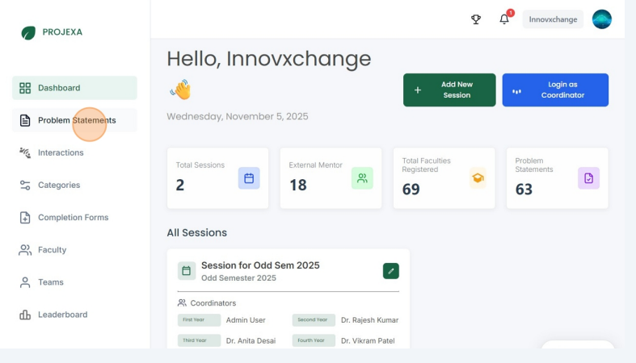
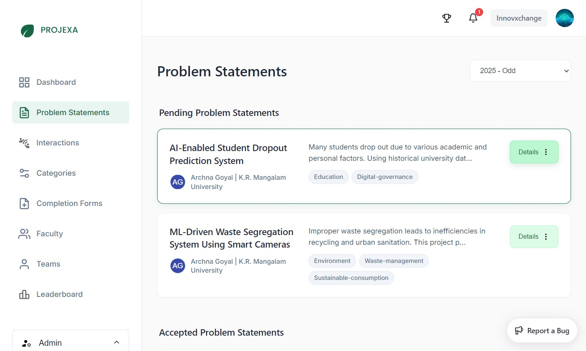
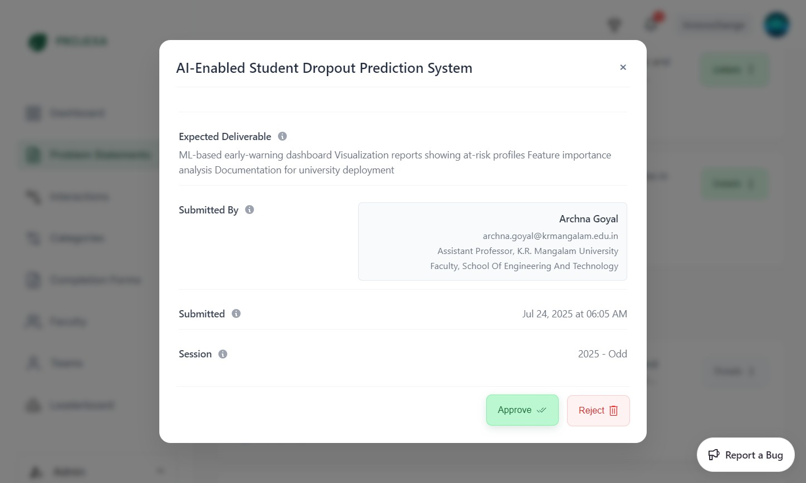

# Admin — Problem Statements

The Problem Statements management feature is a critical quality control mechanism that ensures only high-quality, appropriate project ideas are available for student teams to select. As an admin, you serve as the gatekeeper for all project submissions on the platform.

## Overview

Problem statements can be submitted by anyone—students, mentors, faculty, or external contributors. These submissions appear in the admin panel for review and approval before becoming available to student teams during their team creation process.

### Why Problem Statement Approval Matters

- **Quality Assurance**: Prevents spam and low-quality project ideas from cluttering the platform
- **Educational Value**: Ensures all available projects meet educational standards and learning objectives  
- **Resource Management**: Helps maintain a curated collection of meaningful project opportunities
- **Platform Integrity**: Maintains the professional standard of the academic environment

### How the Process Works

1. **Submission**: Anyone can submit problem statements to the platform
2. **Admin Review**: Submitted statements appear in the admin panel for evaluation
3. **Approval Decision**: Admins approve or reject each submission based on quality assessment
4. **Student Access**: Only approved problem statements become available for teams to select
5. **Team Assignment**: Once a team selects a problem statement, it becomes unavailable to others

### Key Principles

- **Thorough Review**: Each problem statement requires individual assessment—no bulk approvals
- **Quality Focus**: Evaluate submissions for educational value, clarity, and feasibility
- **Open Submission**: Anyone can submit problem statements multiple times if needed
- **Final Authority**: Admin approval is required before any problem statement becomes accessible to students

## Managing Problem Statements

This guide describes how an Admin can approve or reject problem statements submitted by users. Only users with the Admin role can perform these actions.

## Step-by-Step Process

### Reviewing and Approving Problem Statements

1. Click "Problem Statements"

	

2. Click "Details" for the pending problem statement you want to update

	

3. Check the details of the problem statement and click "Approve" to approve it or "Reject" to reject it

	

## Tips for Effective Review

- **Clarity**: Ensure the problem statement is clearly written and understandable
- **Scope**: Verify the project scope is appropriate for the academic level
- **Feasibility**: Consider if the project can be realistically completed within the timeframe
- **Educational Value**: Assess whether the project offers meaningful learning opportunities
- **Completeness**: Check that all necessary information is provided

## Important Notes

- **No Editing**: Problem statements cannot be edited by admins—they must be approved or rejected as submitted
- **Resubmission**: If rejected, contributors can resubmit improved versions
- **Individual Review**: Each problem statement must be reviewed individually to maintain quality standards
- **Immediate Effect**: Approved statements become immediately available for team selection

---

_Last updated: 2025-11-05_
