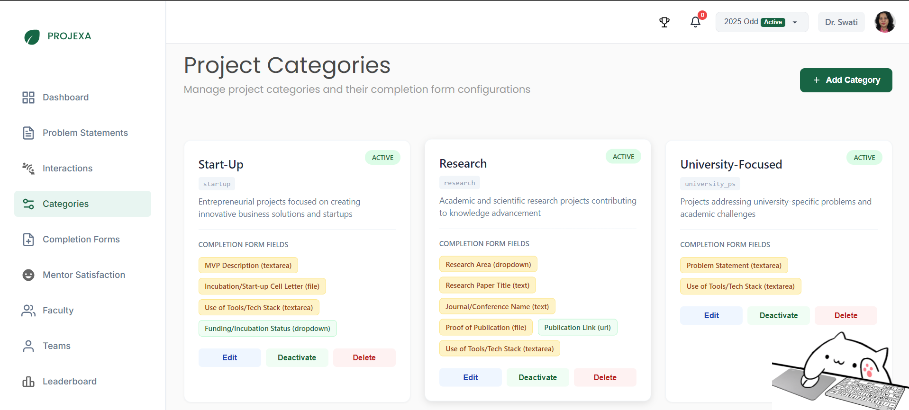
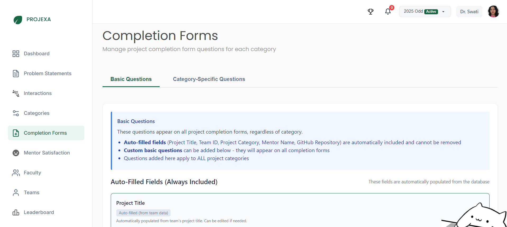

# Admin — Projects

The Projects section provides comprehensive tools for managing project categories and completion workflows. This feature enables administrators to organize projects effectively and gather meaningful data through customizable completion forms.

## Overview

The Projects module consists of two main components designed to streamline project management and data collection:

### Why Project Management Matters

Effective project management is crucial for:
- **Organized Learning**: Categorizing projects helps students and mentors find relevant opportunities
- **Data Collection**: Standardized completion forms ensure consistent project outcomes
- **Quality Assurance**: Custom questions allow for targeted feedback and assessment
- **Progress Tracking**: Structured completion processes provide clear project status

### Core Components
#### 1. Categories Management
Create and manage custom project categories with specific completion requirements

#### 2. Project Completion Forms
Design standardized forms that teams must complete when finishing their projects

## Categories Management

### Creating Project Categories

Categories help organize projects into meaningful groups and enable category-specific evaluation criteria.

#### Required Information:
- **Category ID**: Unique identifier (e.g., "startup", "research", "industry")
- **Category Name**: Display name (e.g., "Start-Up", "Research Project", "Industry Partnership")
- **Description**: Brief explanation of the project category type
- **Color**: Visual identifier using hex color codes (e.g., #186444)

#### Category Features:
- **Fully Customizable**: Create categories that match your institution's project types
- **Editable**: Modify categories after creation as needs evolve
- **Color Coding**: Visual organization through custom color schemes
- **Specific Questions**: Each category can have unique completion form questions

### Benefits of Categorization

- **Targeted Evaluation**: Different project types require different assessment criteria
- **Improved Organization**: Students and mentors can easily find relevant project opportunities
- **Flexible Framework**: Adapt to various academic disciplines and project methodologies
- **Streamlined Management**: Coordinators can better track projects by type

## Completion Forms Management

The completion forms system standardizes how teams document their project outcomes and ensures consistent data collection across all projects.

### Form Structure

#### Basic Questions (Universal)
These questions appear on ALL project completion forms, regardless of category:

**Auto-Filled Fields** (populated from database):
- Team ID
- Team Name  
- Participants
- Project Category
- Mentor Name
- Mentor Email

**Custom Basic Questions**: Add additional questions that apply to all projects

#### Category-Specific Questions
These questions only appear for projects of a specific category. Each category can have its own unique set of questions relevant to that project type.

### Question Types Available

Administrators can create various types of questions using the following field types:

- **Short Answer**: Brief text responses
- **Paragraph**: Longer text responses  
- **Number**: Numeric input
- **Email**: Email address validation
- **URL**: Website link validation
- **Phone**: Phone number input
- **Date**: Date picker
- **Time**: Time selection
- **Date & Time**: Combined date and time picker
- **Dropdown**: Single selection from predefined options
- **Multiple Choice**: Single selection from radio buttons
- **Checkboxes**: Multiple selections allowed
- **Rating (1-5)**: Numerical rating scale
- **File Upload**: Document or media file submission

### Form Configuration

#### Creating Questions
For each question, administrators can specify:
- **Question Label**: The main question text
- **Field Type**: Choose from available question types
- **Placeholder Text**: Optional helpful text for users
- **Required Field**: Checkbox to make questions mandatory
- **Field Description**: Optional help text to guide responses

#### Question Management
- **Add Questions**: Create new basic or category-specific questions
- **Edit Questions**: Modify existing questions as needed
- **Remove Questions**: Delete unnecessary questions
- **Required/Optional**: Toggle whether responses are mandatory

## Workflow Integration

### Project Completion Process

1. **Project Work**: Teams complete their assigned projects throughout the session
2. **Form Submission**: When ready to finish, teams access and complete the relevant completion form
3. **Coordinator Review**: Coordinators review submitted forms and project outcomes
4. **Final Assessment**: Completion forms contribute to overall project evaluation

### Administrative Benefits

- **Standardized Data**: Consistent information collection across all projects
- **Category Flexibility**: Different evaluation criteria for different project types
- **Quality Control**: Ensure teams provide comprehensive project documentation
- **Coordinator Support**: Structured data for coordinator review and assessment

## Best Practices

### Category Design
- **Clear Naming**: Use descriptive category names that teams will understand
- **Logical Organization**: Create categories that reflect actual project types in your curriculum
- **Color Coordination**: Use distinct colors for easy visual identification
- **Comprehensive Descriptions**: Help teams choose the right category for their projects

### Form Design
- **Essential Questions**: Focus on information that's truly necessary for evaluation
- **Clear Instructions**: Use descriptive labels and helpful placeholder text
- **Balanced Requirements**: Mix required and optional questions appropriately
- **Category Relevance**: Ensure category-specific questions are truly unique to that project type

### Data Quality
- **Regular Review**: Periodically assess whether questions are providing useful information
- **Coordinator Feedback**: Gather input from coordinators about form effectiveness
- **Continuous Improvement**: Refine categories and questions based on usage patterns

---

*This system ensures comprehensive project documentation while providing flexibility for different project types and evaluation needs.*

---

_Last updated: 2025-11-06_

