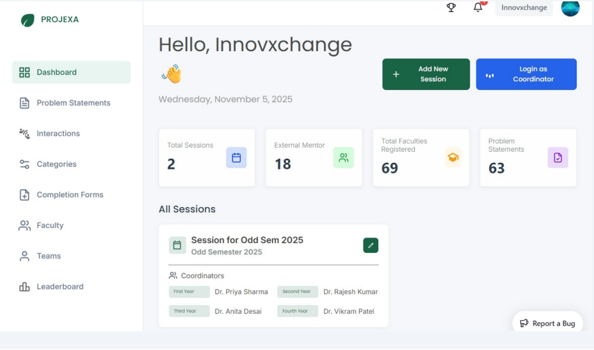
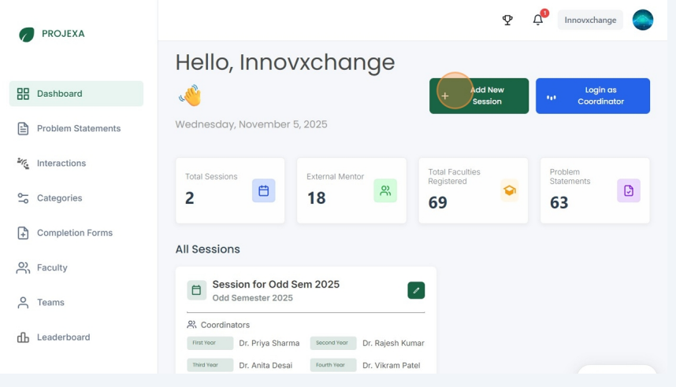
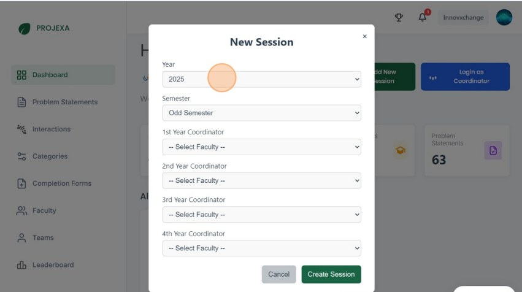
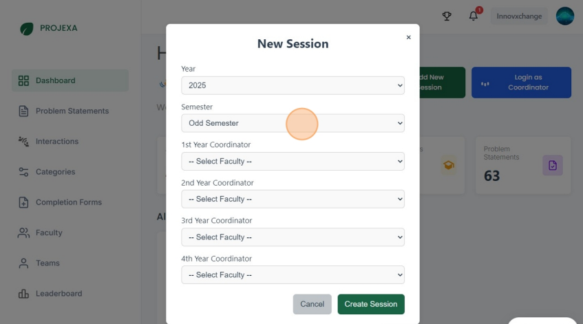
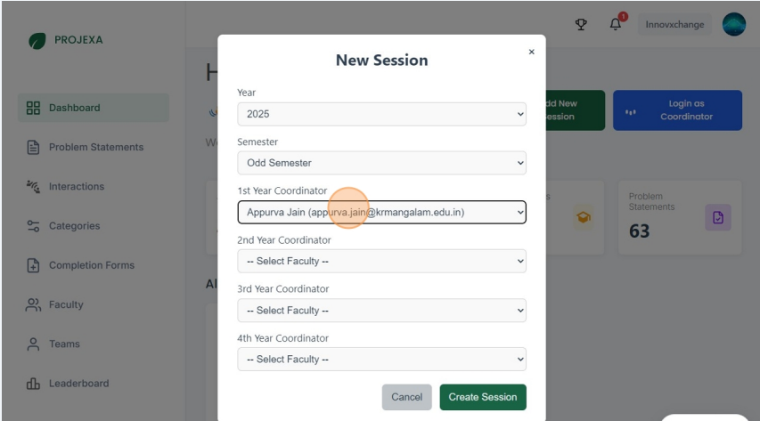
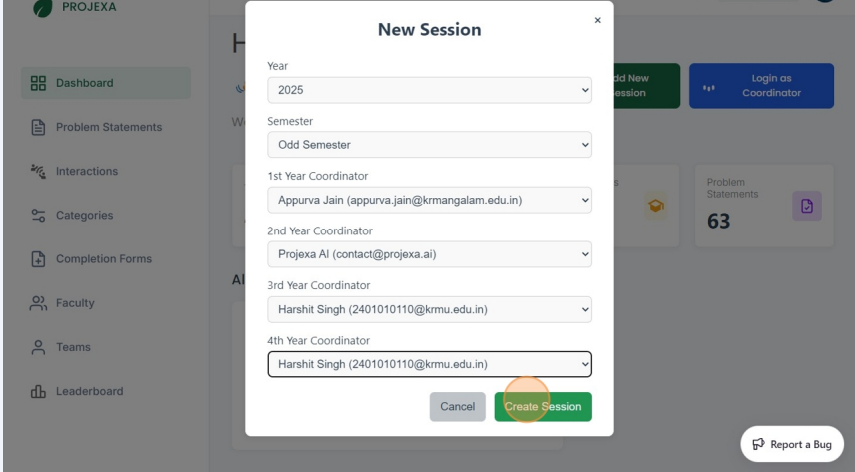
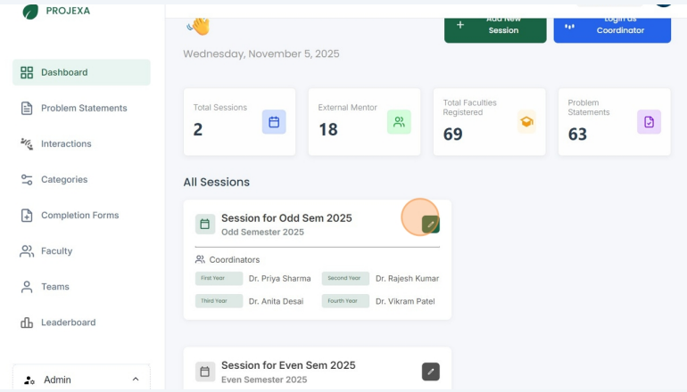
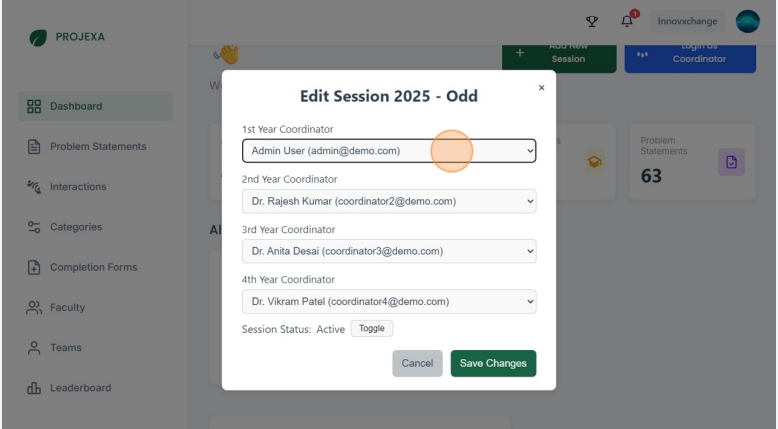
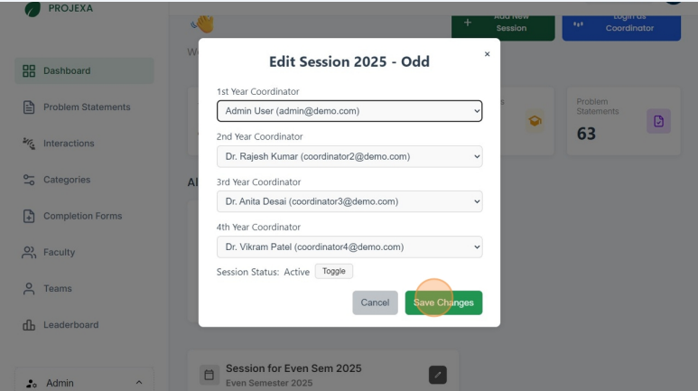

# Admin — Session Management

Session Management is the foundational administrative function that organizes the academic lifecycle within Projexa. Sessions represent distinct academic periods (semesters) where students, teams, and projects operate within a structured timeframe.

## Understanding Sessions

### What is a Session?

A session in Projexa represents an academic semester—a complete cycle of project-based learning activities. Each session creates an isolated environment where:

- Students form new teams and start fresh projects
- Coordinators manage their assigned academic years (1st-4th year)
- Projects and interactions are tracked independently
- Academic timelines and deadlines are enforced

### Session Structure

**Year Selection**: Calendar years (2025, 2026, etc.) that define when the session takes place

**Semester Types**: 
- **Odd Semester**: Typically Fall/Autumn academic periods
- **Even Semester**: Typically Spring academic periods

**Coordinator Assignment**: Each session requires coordinators for all four academic years (1st year, 2nd year, 3rd year, 4th year)

### Why Session Management Matters

- **Academic Organization**: Structures learning into manageable, time-bound periods
- **Fresh Start Opportunity**: Each session allows students to form new teams and tackle new challenges
- **Coordinator Accountability**: Assigns clear responsibility for managing specific academic years
- **Administrative Oversight**: Provides admins with high-level control while coordinators handle day-to-day operations
- **Data Segregation**: Keeps academic periods separate for reporting and analysis

### Session Lifecycle

1. **Creation**: Admin creates a new session with year, semester, and coordinator assignments
2. **Activation**: Session becomes active, allowing student enrollment and team formation
3. **Operation**: Coordinators manage their assigned years, students participate in projects
4. **Completion**: Session reaches its natural end (semester conclusion)
5. **Archival**: Session is set to inactive status for historical record-keeping

### Important Session Rules

- **Coordinator Limitation**: Each coordinator can only manage one active session at a time
- **Mandatory Coverage**: All four academic years (1st-4th) must have assigned coordinators
- **Student Access**: Students can only access the platform within the context of an active session
- **Fresh Start**: New sessions provide a clean slate—students must form new teams and select new projects
- **No Deletion**: Sessions cannot be deleted, only set to inactive status for archival purposes

## Managing Sessions

This section describes how an admin can create a new session and manage existing sessions.

## Add a New Session — Quick

### Creating a New Session

This guide provides a straightforward process for adding a new session in your admin dashboard, ensuring that users can efficiently manage academic timelines. By following the simple steps below you can quickly set up sessions by selecting the year, semester, and coordinator assignments.

**Prerequisites**: Ensure you have coordinators available for all four academic years before creating a session.

1. Navigate to /admin/dashboard

	

2. Click "Add New Session"

	

3. Select the Year from this Dropdown (e.g., 2025, 2026)

	

4. Select the Semester from this dropdown (Odd or Even)

	

5. Select the Coordinator for all years (Assign coordinators for 1st, 2nd, 3rd, and 4th year)

	

6. Click "Create Session"

	

**Result**: The new session becomes active, and coordinators can begin enrolling students for their assigned years.
 
## Update Session Coordinator

### Updating Session Coordinators

Sometimes you may need to change coordinators for an active session—perhaps due to staff changes, workload adjustments, or coordinator availability. This guide explains how to update coordinator assignments.

**Important**: Coordinator changes should be made carefully as they affect ongoing student management and project oversight.

1. Click the edit button on the session's card

	

2. Update the Coordinator from the dropdown options

	

3. Click "Save Changes"

	

**Result**: The new coordinator immediately takes over management responsibilities for their assigned year(s) in this session.

## Administrative Oversight

### Admin Privileges

As an admin, you have special oversight capabilities:

- **Coordinator Account Access**: You can log into any coordinator's account to provide direct support or handle urgent situations
- **Session Monitoring**: View all active sessions and their performance metrics
- **Quality Assurance**: Ensure coordinators are effectively managing their assigned years

### Best Practices

- **Planning**: Create sessions well before the academic period begins
- **Communication**: Inform coordinators about their assignments in advance
- **Monitoring**: Regularly check session progress and coordinator performance
- **Archival**: Set sessions to inactive status at the end of each academic period

### Multiple Session Considerations

While the system supports multiple active sessions simultaneously, this is typically unnecessary. Most institutions operate one primary session per semester to maintain focus and resource allocation.

