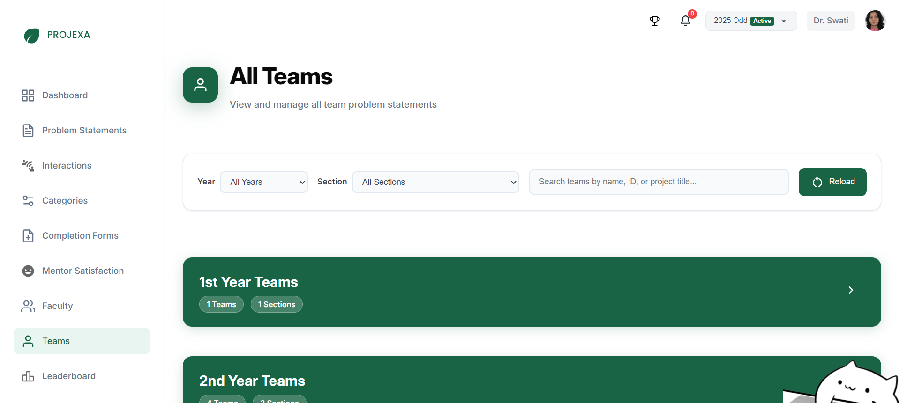

# Admin — Teams & Leaderboard

The Teams & Leaderboard section provides comprehensive oversight of all student teams and their performance within the current session. This feature enables administrators to monitor team formation, project progress, and academic performance across all years and programs.

## Overview

The Teams management system serves as a central hub for monitoring all team activities and performance metrics within the active session. It combines team information display with dynamic leaderboard tracking to provide administrators with complete visibility into student engagement and achievement.

### Why Teams & Leaderboard Management Matters

- **Comprehensive Monitoring**: View all teams across years and programs in one centralized location
- **Progress Tracking**: Monitor problem statement submission status and project development
- **Performance Analysis**: Track individual and team performance through dynamic leaderboards
- **Academic Oversight**: Ensure proper team formation and project alignment across the institution
- **Data-Driven Decisions**: Use performance metrics for academic planning and resource allocation

## Teams Management

### All Teams View

The "All Teams" section provides a comprehensive directory of all student teams in the current session.

#### Team Information Display

For each team, administrators can view:

**Basic Team Details**:
- Team Name (e.g., "Bit Duo", "AlgoVerse")
- Unique Team ID (e.g., "25O4035")
- Problem Statement Status (e.g., "PS Submitted")
- Academic Program (e.g., "B.Tech CSE (AI & ML) Samatrix")
- Section Assignment (e.g., "Section A")
- Academic Year (e.g., "4th Year Teams")
- Team Size and Member Count

**Team Composition**:
- Complete list of team members
- Team member names and roles
- Team leader identification

**Project Information**:
- Project title and description
- Project category (references categories from [Projects Management](admin-projects.md))
- Technology stack and tools
- Problem statement details (truncated view with full access via team dashboard)

#### Filtering and Search Capabilities

**Year Filtering**:
- Filter teams by academic year (1st, 2nd, 3rd, 4th)
- "All Years" option for comprehensive view
- Only years with active teams are displayed

**Section Filtering**:
- Filter by academic sections across programs
- Includes all relevant sections across years (e.g., "B.Tech Sec A", "BCA Sec A")
- Organized by program and section designation

**Search Functionality**:
- Search by team name
- Search by team ID
- Search by project title
- Search by team member names
- Real-time search with instant results

**Data Refresh**:
- "Reload" button for refreshing team data
- Ensures current information display
- Updates team status and member information

### Team Status Monitoring

#### Problem Statement Status

Teams display various status indicators:

- **PS Submitted**: Team leader has selected and submitted a problem statement for review
- **Other Status Types**: Various status indicators showing team progress stages

#### Academic Classification

**Program Information**:
- Academic program enrollment (B.Tech, BCA, etc.)
- Specialization details (AI & ML, Data Science, etc.)
- Institution and department affiliation

**Year and Section Organization**:
- Clear academic year designation
- Section-wise team organization
- Cross-program team visibility

### Administrative Capabilities

#### Read-Only Access

The Teams view provides comprehensive information access:

- **View-Only Interface**: Teams information is displayed for monitoring purposes
- **Detailed Access**: Click on team cards to access complete team dashboards
- **Comprehensive Data**: Full project details, member information, and progress tracking

#### Team Dashboard Access

Clicking on any team card redirects to the team's complete dashboard where administrators can:

- View complete problem statement details
- Access full project information and documentation
- Monitor team interaction history
- Review project progress and milestones
- Access team communication and collaboration tools

## Leaderboard System

The leaderboard provides dynamic performance tracking for both individual students and teams within the current session.

### Scoring Methodology

#### Score Components

Student marks are calculated from multiple performance areas:

**Interaction Performance**:
- Marks awarded by mentors during team-mentor interactions
- Based on participation, preparation, and engagement
- Regular assessment through scheduled meetings

**Evaluation Marks**:
- Formal assessment scores from project evaluations
- Academic performance in presentations and reviews
- Milestone achievement tracking

**Achievement Recognition**:
- Extra-curricular accomplishments and competitions
- Research paper publications and academic contributions
- Hackathon participation and awards
- Recognition at various levels (institutional, national, international)
- Coordinator approval required for achievement submissions

#### Automatic Calculation

- **Dynamic Updates**: Leaderboard updates automatically when new marks are added
- **Real-Time Ranking**: Rankings adjust immediately based on score changes
- **Transparent Methodology**: Consistent scoring across all teams and students

### Student Leaderboard

#### Individual Performance Tracking

**Display Information**:
- Student rank based on total marks
- Student name and identification
- Associated Team ID
- Total accumulated marks
- Year-wise filtering options

**Ranking System**:
- Sorted by highest to lowest total marks
- Automatic rank adjustment for tied scores
- Historical performance consideration

### Team Leaderboard

#### Collective Performance Assessment

**Team Ranking Methodology**:
- Based on average score of all team members
- Calculated automatically from individual member scores
- Reflects overall team performance and collaboration

**Display Information**:
- Team rank position
- Team ID and identification
- Academic year classification
- Average team score
- Complete team member list
- Year-wise filtering capabilities

**Performance Insights**:
- Team collaboration effectiveness
- Collective academic achievement
- Group project success metrics

## Integration with Other Features

### Problem Statement Management

Teams view integrates with the [Problem Statement Management](admin-problem-statements.md) system:

- Teams display problem statement submission status
- Links to full problem statement details
- Integration with approval workflow

### Project Categories

Team projects are organized using categories from [Projects Management](admin-projects.md):

- Category-based project classification
- Consistent organization across teams
- Category-specific evaluation criteria

### Session Context

Teams and leaderboard operate within session boundaries:

- Current session team visibility
- Session-specific performance tracking
- Historical data preservation across sessions

## Administrative Benefits

### Comprehensive Oversight

- **Institution-Wide Visibility**: Monitor all teams across years and programs
- **Progress Tracking**: Real-time updates on team formation and project development
- **Performance Analysis**: Data-driven insights into student and team achievement
- **Resource Planning**: Informed decision-making for academic resource allocation

### Quality Assurance

- **Team Monitoring**: Ensure proper team formation and project selection
- **Academic Standards**: Track performance against institutional benchmarks
- **Engagement Assessment**: Monitor student participation and achievement levels
- **Fair Evaluation**: Transparent and consistent performance measurement

### Strategic Planning

- **Trend Analysis**: Identify patterns in team performance and project preferences
- **Program Effectiveness**: Assess academic program success through team outcomes
- **Mentor Allocation**: Understand team distribution for mentor assignment planning
- **Session Planning**: Use performance data for future session improvements

---

*The Teams & Leaderboard system provides administrators with comprehensive tools for monitoring student engagement, tracking academic performance, and ensuring effective project-based learning outcomes.*

---

_Last updated: 2025-11-06_