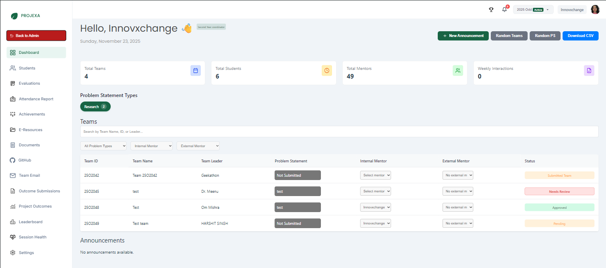

# Coordinator Dashboard

The **Dashboard** is the landing page for Coordinators. It serves as the command center for managing the initial phases of the project lifecycle: Team Formation, Mentor Assignment, and Problem Statement Approval.

## Key Metrics

At the top of the dashboard, you can see a snapshot of the session's current status:

- **Total Teams**: Number of teams formed.
- **Total Students**: Total students enrolled in the session.
- **Total Mentors**: Number of available mentors.
- **Weekly Interactions**: Count of interactions scheduled/completed this week.

## Team Formation Workflow

The team formation process involves actions from both students and coordinators.

### 1. Student Actions

- **Create/Join**: Students log in and either create a new team or join an existing one using a team code.
- **Status - Pending**: When a student creates a team, it appears as **Pending** on the dashboard.
- **Status - Team Submitted**: Once the team is fully formed (members added) and finalized by the students, the status changes to **Team Submitted**.

### 2. Coordinator Actions

Once teams are submitted, the Coordinator takes over:

#### Filtering Teams

Coordinators can filter the team list to find specific groups:

- **All Problem Types**: Filter by project category (e.g., Research, Startup).
- **Internal/External Mentor**: Filter teams based on mentor assignment status:
    - **Has Internal/External Mentor**: View teams that already have a faculty/industry mentor.
    - **No Internal/External Mentor**: View teams that need a mentor assigned.

#### Mentor Assignment

Coordinators must assign a mentor to guide the team.

1.  Locate the team in the list.
2.  **Internal Mentor**: Select a faculty mentor from the dropdown.
    *   *Best Practice*: Assign mentors based on their specialization and the team's project domain.
3.  **External Mentor**: (Optional) Assign an industry mentor if applicable.

#### Problem Statement Review

Teams submit a Problem Statement (PS) for approval. The Coordinator (or the assigned Mentor) must review it.

- **Status - Needs Review**: The team has submitted a PS.
- **Review Process**:
    1.  Click on the team or the status to view the PS details.
    2.  **Approve**: Accept the PS if it is feasible and relevant.
    3.  **Suggest Changes**: Reject the current version with specific feedback/comments. The team must revise and resubmit.
    *   *Delegation*: If the PS is outside your domain, assign an appropriate Mentor first. The Mentor can then review and approve the PS.

## Automated Tools (Random Allocation)

To ensure no student is left behind, Coordinators have access to "Random" allocation tools:

- **Random Teams**: Automatically groups individual students (who haven't joined a team) into new teams. This respects constraints like section and program.
- **Random PS**: Automatically allocates pre-approved problem statements to teams that haven't selected/submitted one. This ensures every team has a project to work on.

## Quick Actions

- **New Announcement**: Post updates for all(both students and mentors), students or mentors 
- **Download CSV**: Export the current list of teams and their statuses.
