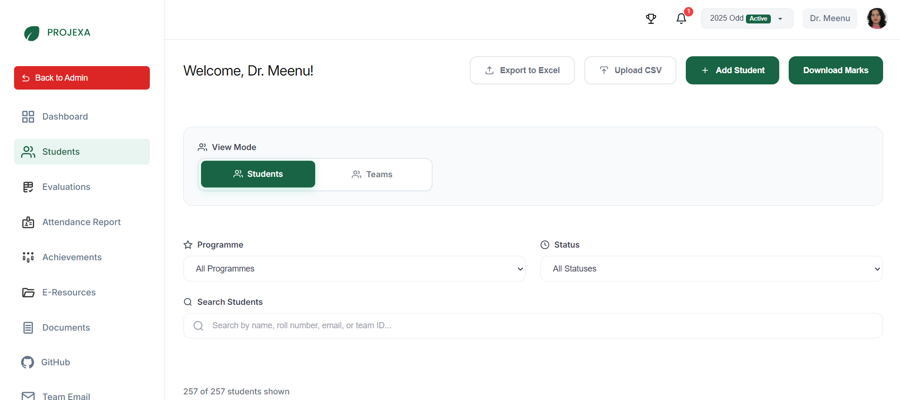
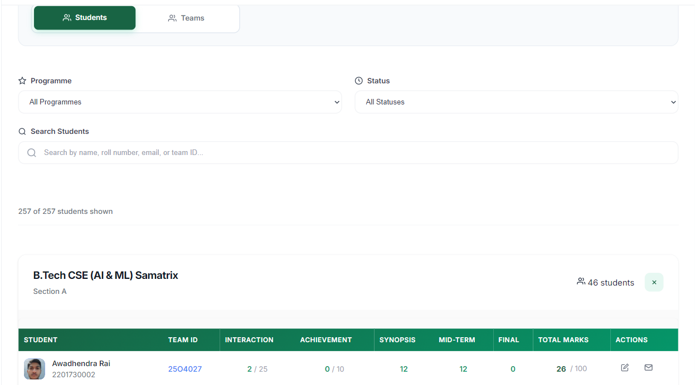
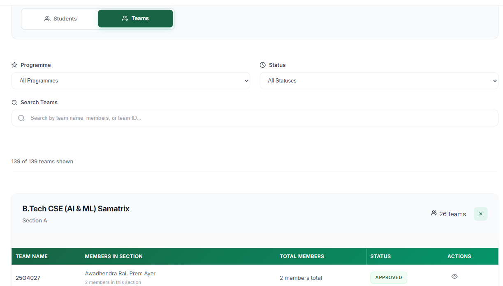

# Coordinator — Students

The Students management system serves as the central hub for managing student enrollment and data for your assigned academic year. This feature enables coordinators to onboard students, update their information, and monitor their academic progress throughout the session.

## Overview

The Student management interface provides a comprehensive view of all enrolled students, combining personal details with performance metrics. It allows coordinators to track engagement, monitor evaluation progress, and ensure all students are on track with their project requirements.

### Why Student Management Matters

-   **Centralized Data**: Access all student information, from contact details to academic performance, in one place.
-   **Performance Tracking**: Monitor individual progress through interaction logs and evaluation marks.
-   **Engagement Monitoring**: Identify students who are falling behind on interactions or submissions.
-   **Efficient Onboarding**: Streamline the process of adding students to the session via bulk tools.
-   **Data Export**: Easily export student data and marks for offline analysis and reporting.

## Student Onboarding

Coordinators have two primary methods for populating the student database for the session:

### 1. Bulk Upload

For adding multiple students simultaneously, the Bulk Upload feature is the most efficient method.

1.  Click the **Upload CSV** button.
2.  **Download Template**: Obtain the required CSV format to ensure data compatibility.
3.  **Fill Data**: Populate the template with student details (Roll No, Name, Email, etc.).
4.  **Upload**: Submit the completed CSV file to the system.

### 2. Manual Addition

For adding individual students who may have been missed during bulk upload or joined late.

1.  Click the **+ Add Student** button.
2.  Fill in the required fields:
    -   **Roll Number**: Unique University Seat Number (read-only after creation).
    -   **Full Name**: Student's legal name.
    -   **Email Address**: Institutional email for communication.
    -   **Mobile Number**: Contact number.
    -   **Programme & Section**: Academic classification (e.g., B.Tech CSE, Section A).

## Student Management

### Student List & Views

The dashboard offers flexible ways to view and organize student data:

#### View Modes
The dashboard offers two primary view modes to manage the cohort:

1.  **Students View** (Default): Lists individual students with their personal performance metrics.

2.  **Teams View**: Groups students by their assigned project teams, providing a high-level overview of team formations.

#### Teams View Details
When switched to **Teams View**, the list displays team-centric information:

-   **Team Name**: Displays the unique Team ID (e.g., 2504027).
-   **Members in Section**: Lists the names of team members belonging to the current section.
-   **Total Members**: Shows the total count of members in the team (useful for cross-section teams).
-   **Status**: Current approval status of the team (e.g., APPROVED).
-   **Actions**:
    -   **Visit Dashboard**: Click the **Eye icon** to navigate to the detailed dashboard of that specific team.

#### Grouping & Filtering
Students are automatically grouped by **Class/Section** (e.g., B.Tech CSE (AI & ML) Samatrix - Section A). Coordinators can further refine the list using:

-   **Programme**: Filter by specific academic programs.
-   **Status**: Filter by project status (Not Assigned, Pending, Team Submitted, Approved, etc.).
-   **Search**: Instantly find students by Name, Roll Number, Email, or Team ID.

### Student Details & Performance

The student table provides a granular view of each student's academic standing within the project workflow.

#### Basic Information
-   **Identity**: Name and Roll Number.
-   **Contact**: Email and Mobile number.
-   **Team Association**: The unique ID of the team the student belongs to (clickable to view team dashboard and interaction/attendance history).

#### Performance Metrics (Leaderboard Data)
The system tracks various performance indicators that contribute to the student's final grade:

-   **Interaction**: System-calculated marks based on the number of interactions logged. Marks are awarded automatically per interaction based on the total weightage and minimum requirement set by the coordinator.
-   **Achievement**: Marks for submitted and approved achievements (e.g., hackathons, research papers).
-   **Evaluations**: Dynamic columns reflecting the specific evaluations configured by the coordinator (e.g., Synopsis, Mid-Term, Final). These columns appear automatically when evaluations are created in the **Evaluations** tab.
-   **Total Marks**: The cumulative score out of 100, calculated as the sum of all performance columns.

### Administrative Actions

Coordinators can perform several key actions directly from the student list:

-   **Edit Details**: Modify student information (Name, Email, Section, etc.). *Note: Roll Number is read-only.*
-   **Communication**: Click the **Email** icon to open the default email client and contact the student.
-   **Export Data**:
    -   **Download Marks**: Export a comprehensive CSV of all student marks and performance data (all students).
    -   **Export to Excel**: Export the currently filtered list of students.

## Communication & Announcements

-   **Send Email**: Use the email icon to quickly contact individual students.
-   **Announcements**: For sending updates to all students, use the announcement feature available from the main dashboard (see [Coordinator Dashboard](dashboard.md)).

## Best Practices

### Data Accuracy
-   **Verify CSVs**: Always double-check the bulk upload CSV against the template to prevent data errors.
-   **Regular Updates**: Keep student contact information up to date to ensure seamless communication.

### Performance Monitoring
-   **Track Interactions**: Regularly review the "Interaction" column to ensure students are meeting the minimum requirement.
-   **Monitor Status**: Use status filters to find students who are "Not Assigned" or "Pending" and follow up with them.

---

*The Student Management system empowers coordinators to maintain a clear and organized record of their cohort, ensuring that every student is accounted for and progressing towards their academic goals.*

---

_Last updated: 2025-11-24_